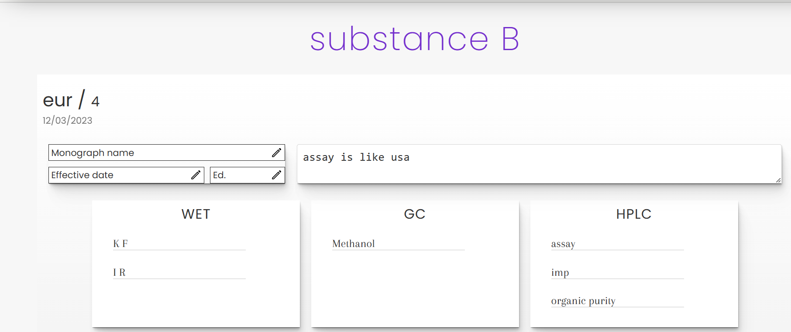
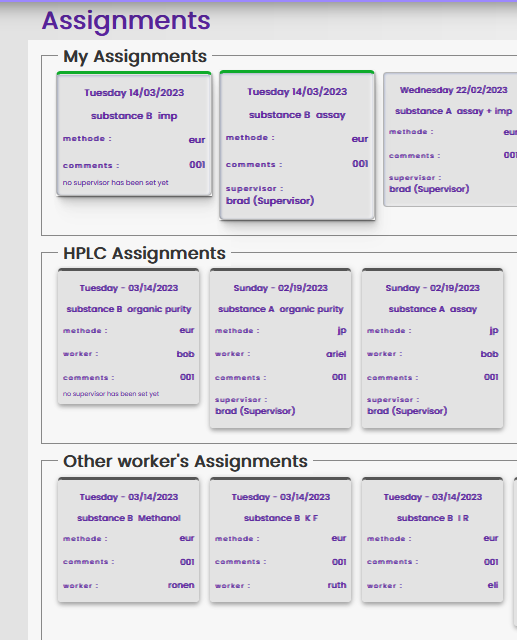
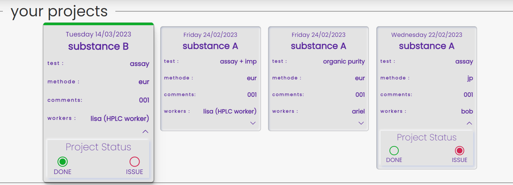

# Lab Tasks Managmant
## overView
> Lab Tasks Managmant is a Web App for pharma analytical laboratories.  
  the App gives to the manager ability to create substances database with their tests  
  and then to create work plan to he employees based on the created database
    
## Technologies
+ React V 18
+ React-Router V 6.3
+ React-Select
+ Date-fns
+ Firebase V 9
  + Authantication
  + firesore
  + storage
  + firestore-rules
+ Scss

## Detailed explanation
> After Authantication check the App detect user's role that could be manager,supervisor or employee

### manager
> The manager control the App by the database and dashboard modules,witch can be create,update and deleat only by the manager

> **database module** - create substances database with their tests with the ability to modify test name and substance details

>**dashboard module** - allows the manager to create a new project and assign it to workers and supervisor(person who check and approve other workers tests)
#### add project (*create new project*)
> select substance from the database list and fill tests details

> after saving the project the manager can see the project that has been created at "see project" page
#### see projects
> all the runnig projects in the laboratory are organized by card

>all the project's tests are hidden in cards  behind their technology,by clicking the chevron the tests card become visible

> When the manager decide to assign a test to supervisor for approval, he choose supervisor from the supervisor list and attach him due date

>*tests status*
The tests status box allows the manager to be informed with the status of each test (for status indication meaning see below at the supervisor section)

### workers
> The page of the workers divided into three sections

***Their tests*** - all the direct tests that belong to the worker, the tests are ordered by date and the daily test is highlighted.  
whenever the manager will assign supervisor to the test, it will update at the worker too.  
***Other workers's tests within the same technology*** - The App distinguish every worker by his technology and expose him to other members tests with the same technology.  
***All the other tests*** - at the end of the page the worker see all the other tests that belong to other technologies

### supervisor 
When the supervisor finished to check the test he has the ability to indicate the test status by the "project status box" ,he can mark approve, issue or both, when the checkbox was filled it immadiatly reflected in the manager's  status box

## Links
Detailed explanation in hebrew about this App on YouTube
[Lab Tasks Managmant App](https://youtu.be/OYyHok3CFOM) 

